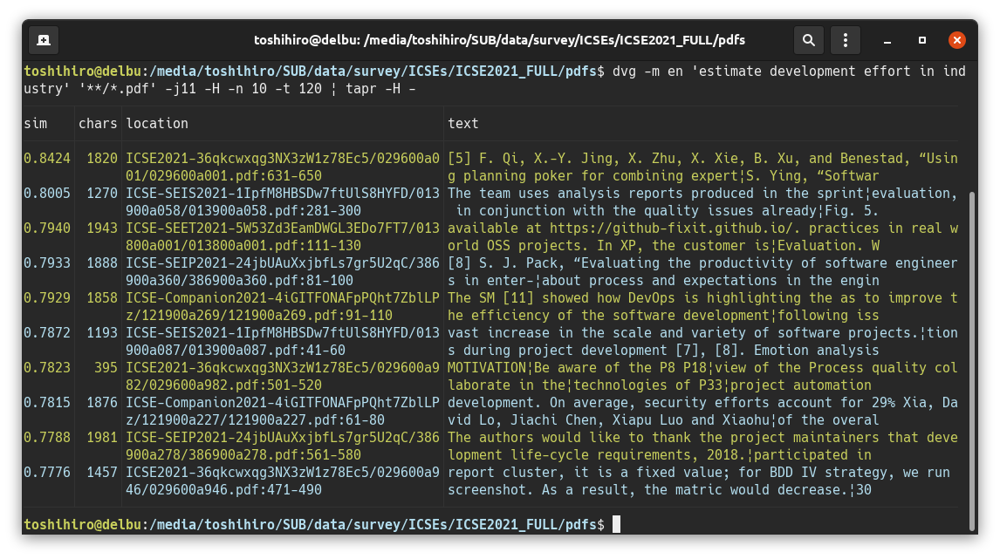

# tapr

`tapr` is a table pretty-printer. Outputs a CSV or TSV file as nicely as possible by adjusting column widths.

Screenshot:  


## Installation

```sh
cargo install tapr
```

## CLI

```
USAGE:
    tapr [FLAGS] [OPTIONS] <input>

FLAGS:
    -c, --csv            Force treats input file as CSV
    -h, --help           Prints help information
    -H, --header         Prints first line as a header
    -n, --line-number    Prints line number
    -t, --tsv            Force treats input file as TSV
    -V, --version        Prints version information

OPTIONS:
        --line-sampling <line-sampling>    Sampling size of lines to determine width of each column [default: 100]

ARGS:
    <input>    Input file. Specify `-` to read from the standard input
```

To pipe `tapr` to `less`, do not forget to specify `--raw-control-chars` option to `less`:

```sh
...(some command)... | tapr - | less -R
```

## License

MIT/Apache-2.0
