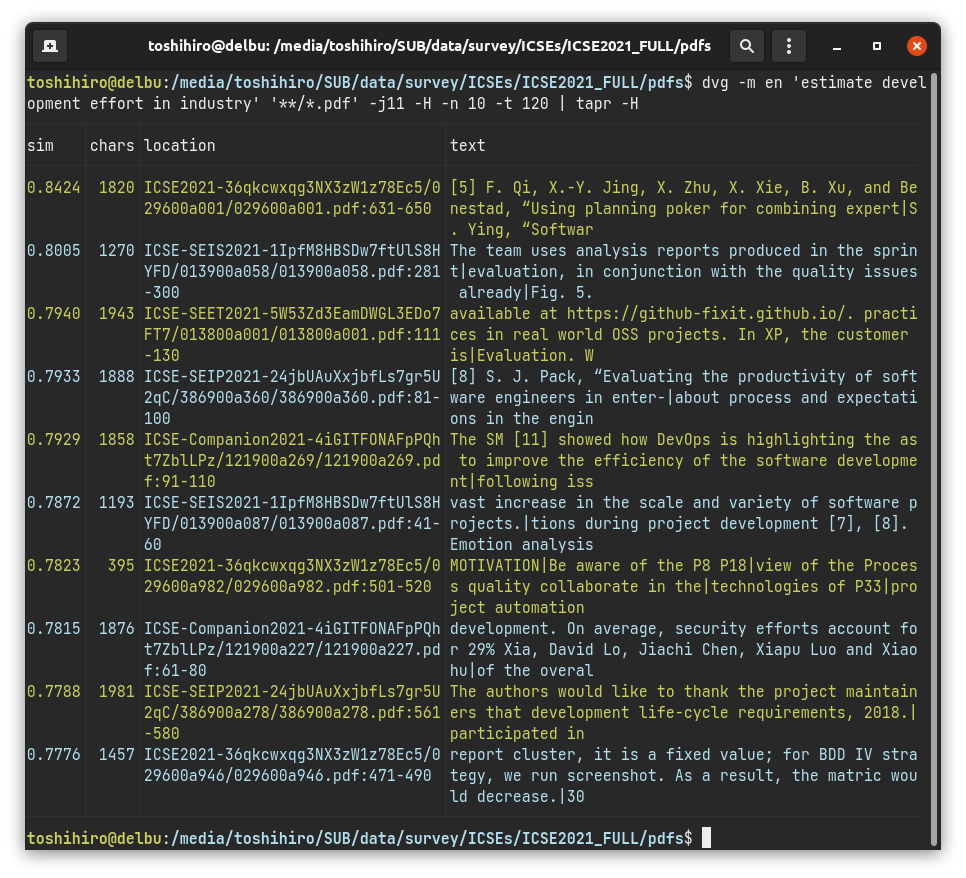

# tapr

`tapr` is a table pretty-printer. Outputs a CSV or TSV file as nicely as possible by adjusting column widths.

Screenshot:  


## Installation

```sh
cargo install tapr
```

## CLI

```
USAGE:
    tapr [FLAGS] [input]

FLAGS:
    -c, --csv            Force treat input as CSV
    -h, --help           Prints help information
    -H, --header         Print first line as a header
    -n, --line-number    Print line number
    -t, --tsv            Force treat input as TSV
    -V, --version        Prints version information

ARGS:
    <input>    Input file
```

## License

MIT/Apache-2.0
